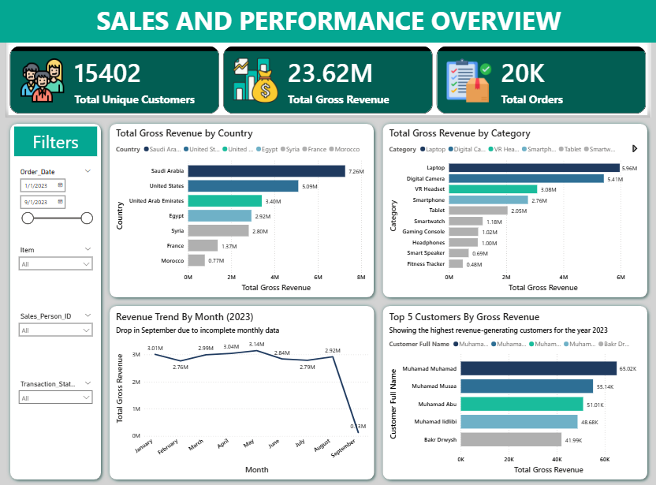

# 📊 Customer Sales/Order Performance Dashboard

## 🔍 Project Overview

This project analyzes customer order data to evaluate sales performance, customer behavior, and revenue distribution across different countries and product categories. The dashboard provides a comprehensive view of key business metrics and trends.
Gross revenue was used because there was no clear definition of the discount column.

---

## 🎯 Objective

The objective of this project is to identify key revenue drivers, analyze customer purchasing patterns, and evaluate sales trends to support business growth and strategic decision-making.

---

## 📌 Key Insights

* The business generated **23.62M in total revenue** from over **20K orders**, indicating strong sales performance.
* **Saudi Arabia is the top revenue-generating country**, significantly outperforming other regions.
* The **United States and UAE also contribute substantial revenue**, highlighting key international markets.
* **Laptops and Digital Cameras are the highest revenue-generating products**, making them core business drivers.
* Revenue remains **relatively stable from January to August**, indicating consistent sales performance.
* A sharp drop in September revenue is observed due to **incomplete monthly data**, not an actual decline.
* A small group of customers contributes a large portion of revenue, indicating the presence of **high-value customers**.

---

## 📊 Dashboard Features

* KPI Cards (Total Gross Revenue, Total Customers, Total Orders)
* Gross Revenue by Country Analysis
* Gross Revenue by Product Category
* Monthly Gross Revenue Trend
* Top 5 Customers by Gross Revenue
* Interactive Filters for dynamic analysis

---

## 🛠️ Tools & Technologies

* **SQL** – Data cleaning and transformation
* **Power BI** – Data visualization and dashboard development

---

## 📁 Dataset Description

The dataset contains customer order records with key fields such as:

* Customer Information
* Order Details
* Product Categories
* Sales and Revenue Data
* Transaction Information

---

## 🚀 Key Skills Demonstrated

* Data Cleaning and Transformation using SQL
* Data Visualization and Dashboard Design
* KPI Development and Business Metrics Analysis
* Customer Segmentation and Analysis
* Trend Analysis and Insight Generation

---

## 📷 Dashboard Preview

---

## 📌 Conclusion

This dashboard provides valuable insights into customer purchasing behavior and sales performance. It highlights key revenue drivers, top-performing markets, and high-value customers, enabling better strategic and operational decisions.

---

